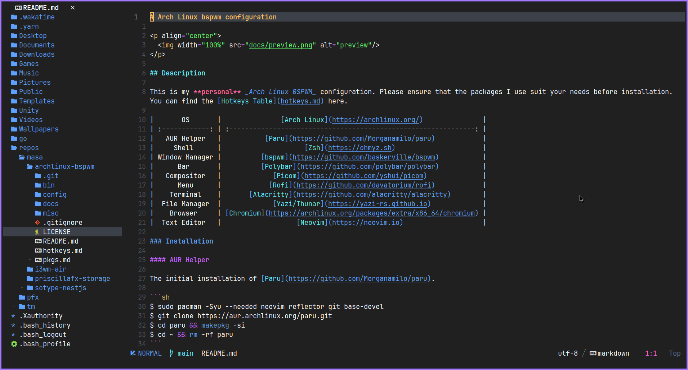
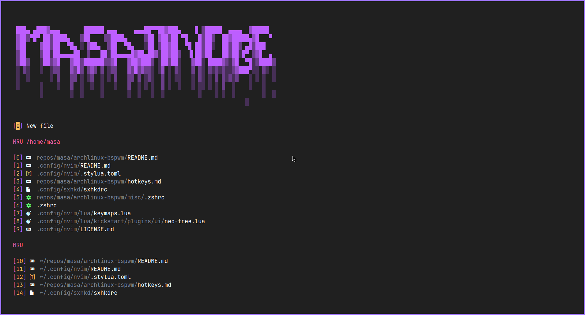

# modular.nvim

<p align="center">
  
</p>

<p align="center">
  
</p>

## Installation

### Install Neovim

modular.nvim targets _only_ the latest
['stable'](https://github.com/neovim/neovim/releases/tag/stable) and latest
['nightly'](https://github.com/neovim/neovim/releases/tag/nightly) of Neovim.
If you are experiencing issues, please make sure you have the latest versions.

### Install External Dependencies

External Requirements:

- Basic utils: `git`, `make`, `unzip`, C Compiler (`gcc`)
- [ripgrep](https://github.com/BurntSushi/ripgrep#installation)
- Clipboard tool (xclip/xsel/win32yank or other depending on platform)
- A [Nerd Font](https://www.nerdfonts.com/): optional, provides various icons
  - if you have it set `vim.g.have_nerd_font` in `init.lua` to true
- Language Setup:
  - If you want to write Typescript, you need `npm`
  - If you want to write Golang, you will need `go`
  - etc.

### Install Modular

> **NOTE**
> Backup your previous configuration (if any exists)

```sh
mv ~/.config/nvim ~/.config/nvim.bak
mv ~/.local/share/nvim ~/.local/share/nvim.bak
mv ~/.local/state/nvim ~/.local/state/nvim.bak
mv ~/.cache/nvim ~/.cache/nvim.bak
```

Neovim's configurations are located under the following paths, depending on your OS:

| OS                   | PATH                                      |
| :------------------- | :---------------------------------------- |
| Linux, MacOS         | `$XDG_CONFIG_HOME/nvim`, `~/.config/nvim` |
| Windows (cmd)        | `%localappdata%\nvim\`                    |
| Windows (powershell) | `$env:LOCALAPPDATA\nvim\`                 |

#### Clone modular.nvim

<details><summary> Linux and Mac </summary>

```sh
git clone https://github.com/masajinobe-ef/modular.nvim.git "${XDG_CONFIG_HOME:-$HOME/.config}"/nvim
```

</details>

<details><summary> Windows </summary>

If you're using `cmd.exe`:

```
git clone https://github.com/masajinobe-ef/modular.nvim.git "%localappdata%\nvim"
```

If you're using `powershell.exe`

```
git clone https://github.com/masajinobe-ef/modular.nvim.git "${env:LOCALAPPDATA}\nvim"
```

</details>

### Post Installation

Start Neovim

```sh
nvim
```

That's it! Lazy will install all the plugins you have. Use `:Lazy` to view
current plugin status. Hit `q` to close the window.

<details><summary>Fedora Install Steps</summary>

```
sudo dnf install -y gcc make git ripgrep fd-find unzip neovim
```

</details>

<details><summary>Arch Install Steps</summary>

```
sudo pacman -S --noconfirm --needed gcc make git ripgrep fd unzip neovim
```

</details>

based on [Kickstart.nvim](https://github.com/nvim-lua/kickstart.nvim)
